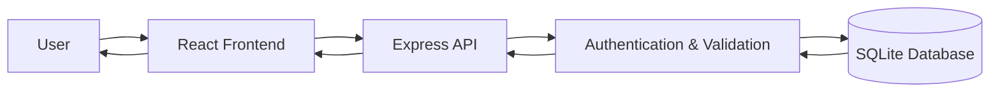
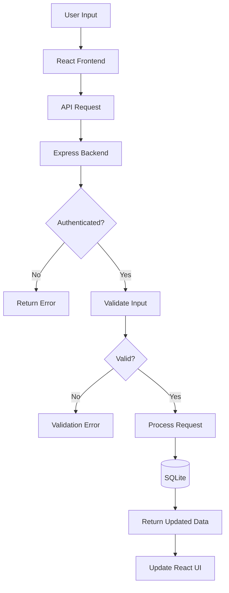
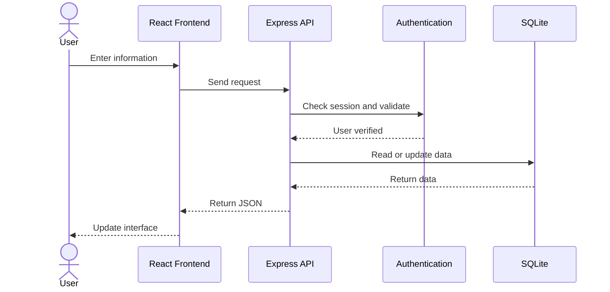
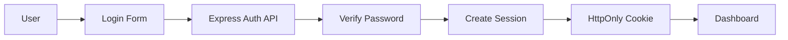
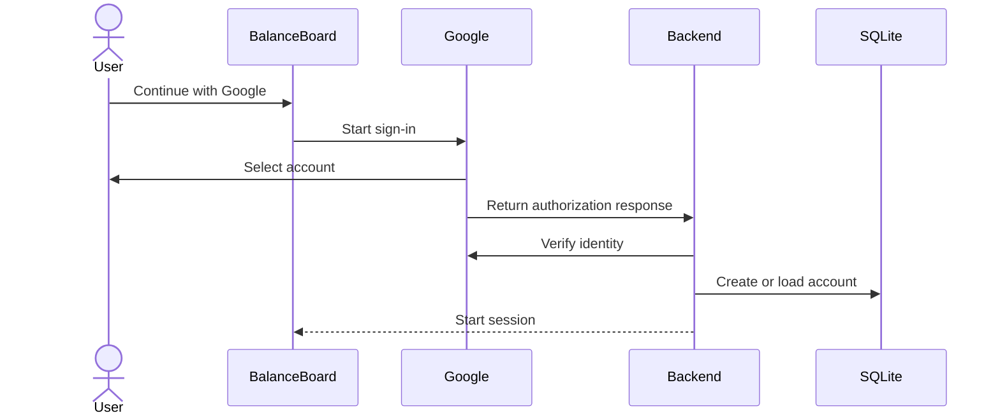
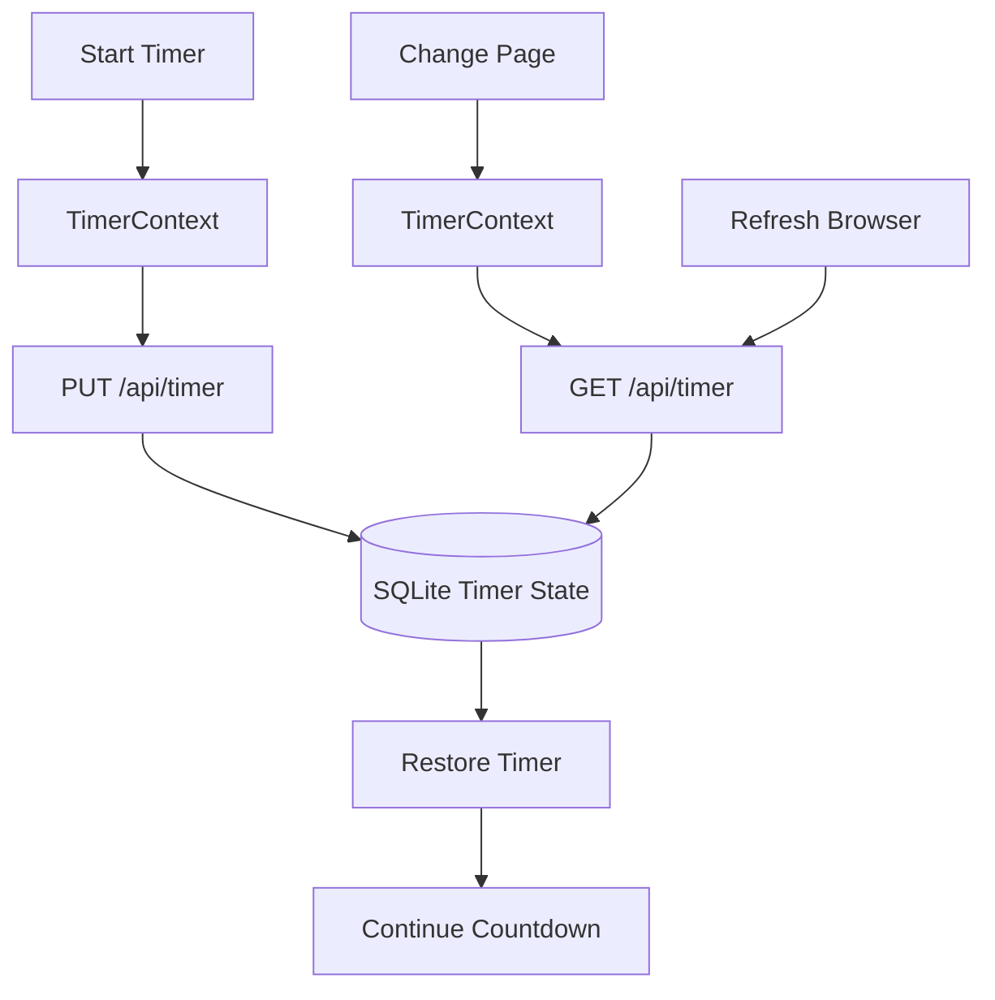
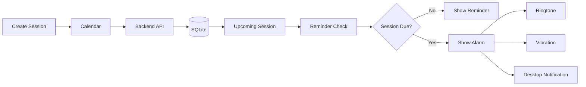

# BalanceBoard

A full-stack productivity and wellbeing web app for managing study tasks, exercise, calendar sessions, focus time, mood, hydration and progress.

</div>

---

## Overview

I built BalanceBoard to keep daily study and wellbeing activities in one place.

The app allows users to:

- create an account and sign in
- add study tasks and exercise activities
- schedule sessions in the calendar
- run a focus or exercise timer
- track mood and water intake
- view reminders, analytics and achievements
- update profile and alarm settings
- keep data saved between sessions

The application uses **React**, **Express**, and **SQLite**.

---

## Main Features

- User registration and login
- Google sign-in support
- Study task management
- Exercise tracking
- Persistent focus timer
- Calendar scheduling
- Mood tracking
- Hydration tracking
- Reminder system
- Ringtone and vibration support
- Desktop browser notifications
- Profile settings
- Analytics and achievements
- Per-user data separation
- SQLite persistence
- Frontend and backend validation

---

# System Architecture

BalanceBoard uses a three-layer architecture.



### Frontend

React handles the user interface:

- Dashboard
- Login and registration
- Study tasks
- Exercise
- Calendar
- Profile
- Timer
- Reminders
- Analytics
- Achievements

The frontend communicates with the backend through HTTP requests.

### Backend

Express handles:

- API requests
- authentication
- validation
- session management
- timer actions
- profile updates
- study and exercise actions
- calendar actions
- reading and writing database data

### Database

SQLite stores:

- users
- sessions
- profile settings
- study tasks
- exercise activities
- calendar sessions
- mood entries
- hydration entries
- timer state
- progress data

---

# Input → Processing → Output



### Input

Examples:

- username, email and password
- study task title
- focus minutes
- exercise activity
- date and time
- mood
- water intake
- timer controls
- profile settings

### Processing

1. The user enters information.
2. React sends the request to Express.
3. Express checks the session.
4. The backend validates the data.
5. The requested action is processed.
6. SQLite is updated.
7. The backend returns JSON.
8. React updates the page.

### Output

Examples:

- updated task list
- timer countdown
- saved progress
- calendar sessions
- reminders
- mood and hydration records
- analytics
- achievements
- profile information

---

# Application Data Flow



Example:

```text
User creates a study task
        ↓
React form
        ↓
POST /api/actions
        ↓
Express backend
        ↓
Authentication + validation
        ↓
SQLite
        ↓
Updated data
        ↓
React dashboard
```

---

# Authentication Flow

## Password Login



Passwords are protected using **scrypt with a unique salt**.

After login, the server creates a session token. The browser stores the session using an **HttpOnly cookie**.

---

## Google Sign-In



Google login uses the authorization-code flow with state, nonce and PKCE.

---

# Timer Architecture

The timer is stored on the backend instead of only inside one page.

This allows it to continue when the user moves between Dashboard, Calendar, Profile and Analytics.



Timer actions include:

- start
- pause
- resume
- reset
- discard
- complete
- save progress

---

# Calendar and Alarm Flow



The browser can play a ringtone, use vibration when supported and show desktop notifications when permission is enabled.

---

# Technology Stack

| Area | Technology |
|---|---|
| Frontend | React |
| Build Tool | Vite |
| Backend | Node.js |
| API | Express |
| Database | SQLite |
| Authentication | Password login + Google OAuth |
| Password Security | scrypt |
| Sessions | HttpOnly cookie |
| Source Control | Git + GitHub |

---

# Project Structure

```text
BalanceBoard/
│
├── public/
├── scripts/
│   └── dev.js
│
├── server/
│   ├── data/
│   └── src/
│       ├── server.js
│       ├── googleAuth.js
│       ├── timer.js
│       ├── server.test.js
│       └── timer.test.js
│
├── src/
│   ├── components/
│   ├── context/
│   │   └── TimerContext.jsx
│   ├── pages/
│   │   └── Profile.jsx
│   └── ...
│
├── .env.example
├── .gitignore
├── DEPLOY.md
├── README.md
├── index.html
├── package.json
├── package-lock.json
└── vite.config.js
```

---

# How to Run BalanceBoard

## 1. Requirements

Install:

- Node.js 22.13 or newer
- npm

Check:

```bash
node -v
npm -v
```

---

## 2. Clone the Repository

```bash
git clone https://github.com/kushalshrestha303-web/BalanceBoard.git
cd BalanceBoard
```

---

## 3. Install Frontend Dependencies

```bash
npm ci
```

---

## 4. Install Backend Dependencies

```bash
npm ci --prefix server
```

---

## 5. Start the App

```bash
npm run dev
```

Open:

```text
http://localhost:5173
```

The development setup starts:

```text
Frontend: http://localhost:5173
Backend:  http://localhost:3001
```

You can create a normal account immediately.

Google sign-in is optional.

---

# Google Sign-In Setup

Create a Google OAuth Web Application in Google Cloud Console.

Use:

```text
Authorized JavaScript origin:
http://localhost:5173
```

```text
Authorized redirect URI:
http://localhost:5173/api/auth/google/callback
```

Copy:

```text
.env.example
```

to:

```text
.env
```

Add:

```env
GOOGLE_CLIENT_ID=your_google_client_id
GOOGLE_CLIENT_SECRET=your_google_client_secret
APP_ORIGIN=http://localhost:5173
```

Restart:

```bash
npm run dev
```

Do not commit `.env` to GitHub.

---

# Production Build

Build the app:

```bash
npm run build
```

Start the production server:

```bash
npm start
```

Open:

```text
http://localhost:3001
```

---

# Database

The local SQLite database is stored in:

```text
server/data/balanceboard.sqlite
```

The database stores the application data and keeps it available after restart.

Do not upload the SQLite database to GitHub.

Recommended `.gitignore` entries:

```gitignore
node_modules/
.env
.env.local
.env.production
dist/
.vercel/
server/data/*.sqlite
server/data/*.sqlite-*
```

---

# API Overview

### Authentication

```text
POST /api/auth/register
POST /api/auth/login
POST /api/auth/logout
GET  /api/auth/me
GET  /api/auth/google
GET  /api/auth/google/callback
```

### Profile

```text
GET   /api/profile
PATCH /api/profile
PATCH /api/profile/password
```

### Dashboard

```text
GET  /api/dashboard?day=YYYY-MM-DD
POST /api/actions
```

### Timer

```text
GET  /api/timer
PUT  /api/timer
POST /api/timer/actions
```

### Alarm

```text
GET /api/alarms/due?day=YYYY-MM-DD&time=HH:mm
```

---

# Testing

Build check:

```bash
npm run build
```

Run tests:

```bash
npm test
```

Tests cover important backend functions including:

- registration
- login
- logout
- profile updates
- password changes
- account separation
- alarms
- Google authentication flow
- timer persistence
- pause and resume
- timer recovery
- progress saving

---

# Simple Architecture Explanation

BalanceBoard uses **React** for the frontend, **Express** for the backend and **SQLite** for the database.

When a user performs an action, React sends a request to Express. The backend checks the user's session, validates the information and then reads or updates SQLite. The result is returned to React and shown on the screen.

The timer is also stored in the backend so it can continue across different pages and recover after a refresh.

---

## Repository

https://github.com/kushalshrestha303-web/BalanceBoard

## Author

**Kushal Shrestha**

<div align="center">

**Plan • Focus • Track • Balance**

</div>
