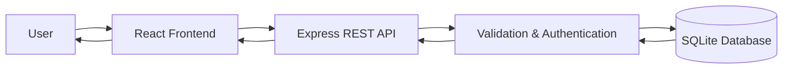
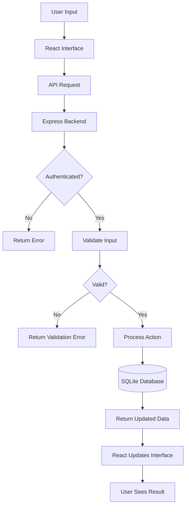
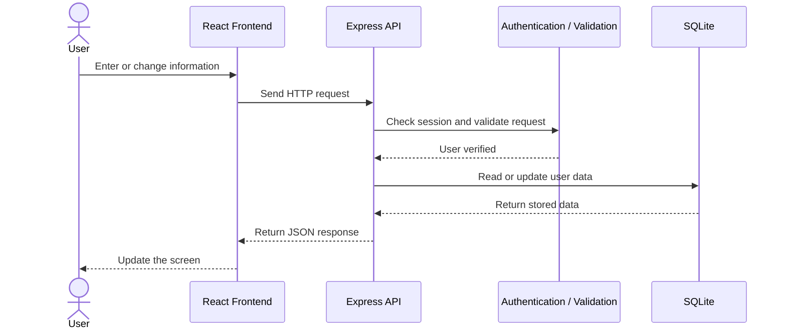
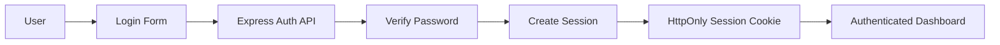
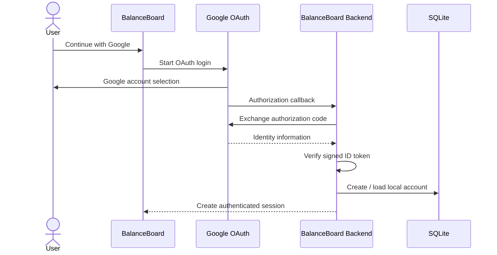
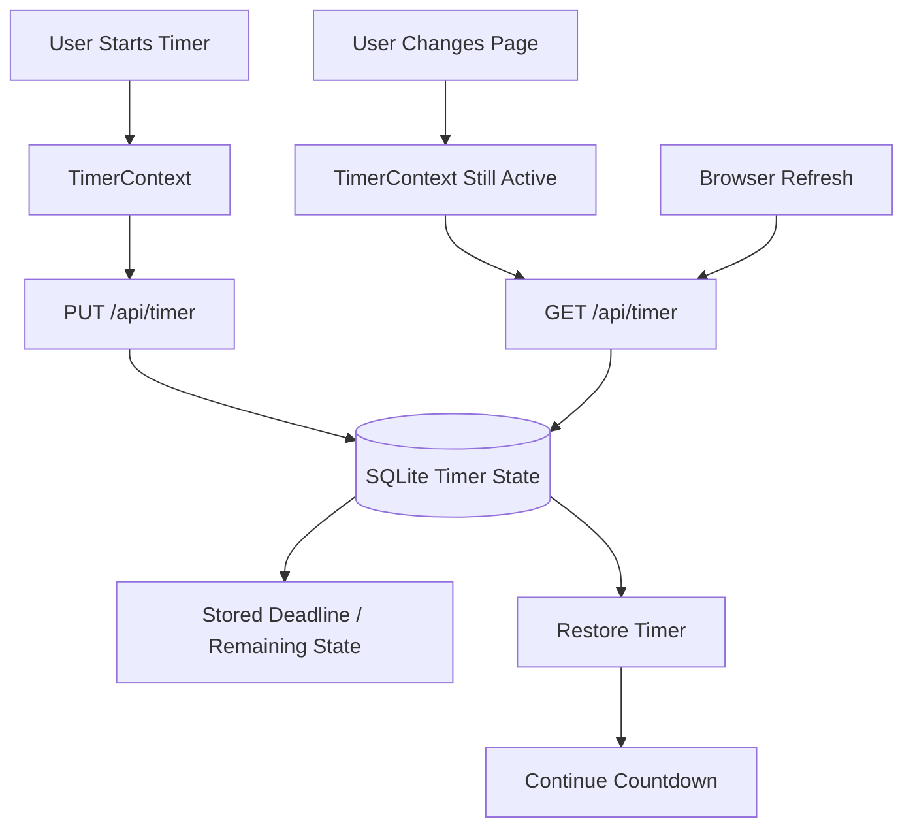
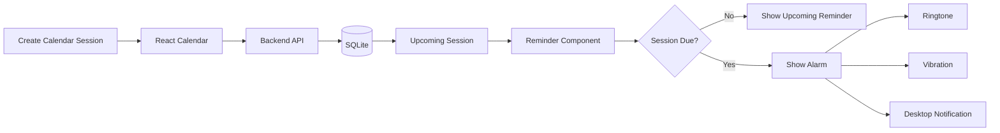
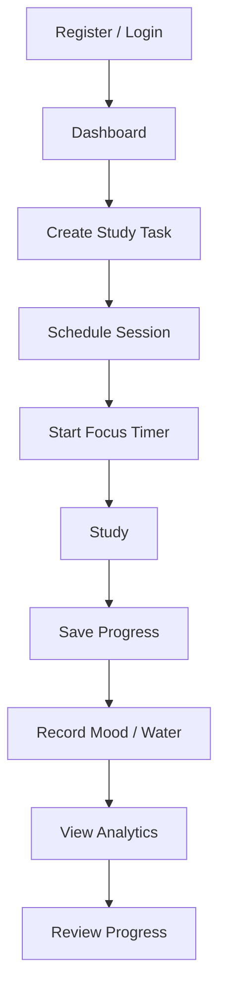

<div align="center">


# BalanceBoard

### A full-stack productivity and wellbeing application

BalanceBoard brings **study planning, exercise, calendar scheduling, focus timers, mood, hydration, reminders, analytics and achievements** into one place.

I designed the app so the frontend, backend and database work together as one complete system, with persistent user accounts and saved activity data.

</div>

---

## Why I built this

I built BalanceBoard to bring study planning, exercise, scheduling, focus sessions and daily wellbeing into one simple dashboard. The goal is to make it easier to plan the day, stay focused and track progress without switching between multiple apps.

The main idea is simple:

> **Plan → Focus → Record → Review**

A user signs in, adds activities, schedules sessions, uses the timer, records wellbeing information and then reviews their progress through the dashboard and analytics pages.

---

## Main features

- User registration and password login
- Optional Google sign-in
- Personal profile and account settings
- Study task management
- Exercise activity tracking
- Persistent Pomodoro / focus timer
- Calendar scheduling
- Mood tracking
- Water tracking
- Upcoming session reminders
- Browser ringtone and vibration support for scheduled sessions
- Desktop browser notifications when permission is granted
- Analytics and achievement views
- Per-user data isolation
- Persistent SQLite database
- Frontend and backend validation
- API integration between React and Express

---

# System Architecture

BalanceBoard uses a simple three-layer full-stack architecture.



### 1. Presentation layer — React

The React frontend is responsible for everything the user sees and interacts with.

Examples include:

- login and registration forms
- dashboard
- study tasks
- exercise activities
- calendar
- profile settings
- timer
- reminders
- analytics
- achievements

The frontend does not directly access the database. It communicates with the backend using HTTP API requests.

### 2. Application layer — Express

The Express server contains the main backend logic.

It is responsible for:

- receiving API requests
- checking the logged-in user
- validating incoming data
- processing actions
- managing authentication
- managing sessions
- reading and writing data
- returning JSON responses to the frontend

### 3. Data layer — SQLite

SQLite stores the persistent application data.

The database keeps information such as:

- user accounts
- sessions
- profile settings
- tasks
- exercise activities
- calendar sessions
- mood entries
- water entries
- timer state
- progress information

This means the user's information remains available after the page is refreshed or the server is restarted.

---

# Input, Processing and Output

One easy way to explain BalanceBoard is to describe it as an **Input → Processing → Storage → Output** system.



## Input examples

The user can provide input through forms, buttons and controls.

| User input | Example |
|---|---|
| Account information | Name, email and password |
| Study task | "Study ICT930 for 45 minutes" |
| Exercise | "Walk for 30 minutes" |
| Calendar session | Date, time and linked activity |
| Mood | Daily mood selection |
| Hydration | Water intake |
| Timer | Start, pause, resume, reset or save |
| Profile settings | Display name, email and alarm settings |

## Processing

After the user performs an action:

1. React collects the information.
2. React sends an API request to Express.
3. Express checks the user's session.
4. The backend validates the submitted data.
5. The requested action is processed.
6. SQLite is updated when required.
7. The server sends a response back to React.

## Output

The final output is shown back to the user through the interface.

Examples include:

- updated task lists
- completed study minutes
- timer countdown
- upcoming calendar sessions
- mood and hydration information
- reminder banners
- alarm notifications
- analytics
- achievements
- profile information

---

# Application Data Flow

This is the normal data flow when a signed-in user changes something in BalanceBoard.



### Simple example

If the user adds a study task called **"Prepare for ICT930 quiz"**:

```text
User
  ↓
Task form
  ↓
React frontend
  ↓
POST /api/actions
  ↓
Express server
  ↓
Authentication + validation
  ↓
SQLite database
  ↓
Updated dashboard data
  ↓
React interface
  ↓
New task appears on screen
```

---

# Authentication Flow

BalanceBoard supports local password authentication and optional Google authentication.

## Password login



Passwords are not stored as plain text. They are processed using **scrypt with a unique salt**.

After successful authentication, the server creates a random session token. The browser receives the token through an **HttpOnly, SameSite=Strict cookie**, while the database stores only a hash of the session token.

Logging out invalidates the session.

---

## Google sign-in

Google authentication uses the OAuth authorization-code flow.



The implementation also uses **state, nonce and PKCE** as part of the Google authentication flow.

Google authentication requires the owner of the deployment to configure valid Google OAuth credentials.

---

# Persistent Timer Architecture

The focus / exercise timer is not only stored inside a React component.

Its state is shared across routes and stored against the signed-in account in SQLite.

That is why moving from Dashboard to Calendar, Profile or Analytics does not intentionally restart the timer.



The timer supports:

- start
- pause
- resume
- reset
- discard
- completion
- saving progress

Only one active timer is stored for each account.

Other tabs can synchronize the timer when they regain focus or during periodic synchronization.

---

# Calendar and Alarm Data Flow

Calendar sessions can be created independently or linked to a study task or exercise activity.



The browser can attempt to:

- play a short ringtone
- vibrate the device when supported
- display a desktop notification when permission has been granted

### Important limitation

BalanceBoard is a web application, not a native background alarm service.

The alarm feature works while the application is open, but browsers can restrict background tabs. An alarm therefore cannot be guaranteed after the browser is completely closed or the device is asleep.

---

# Example User Journey

A typical BalanceBoard session looks like this:



For example:

1. I log in to my BalanceBoard account.
2. I create a task called **"Study SC-200"** for 45 minutes.
3. I schedule the task for 7:00 PM.
4. I start the focus timer.
5. I move to another page and the timer continues.
6. When the session time is reached, BalanceBoard can show an alarm while the app is open.
7. I save the completed focus time.
8. The dashboard and analytics reflect the updated progress.

---

# API Overview

The frontend communicates with the backend through REST-style API endpoints.

### Authentication

```text
GET  /api/auth/providers
GET  /api/auth/google
GET  /api/auth/google/callback

POST /api/auth/register
POST /api/auth/login
POST /api/auth/logout

GET  /api/auth/me
```

### Profile

```text
GET   /api/profile
PATCH /api/profile
PATCH /api/profile/password
```

### Dashboard and actions

```text
GET  /api/dashboard?day=YYYY-MM-DD
POST /api/actions
```

Example action:

```json
{
  "type": "task.add",
  "payload": {
    "title": "Study",
    "focusMinutes": 25
  }
}
```

### Timer

```text
GET  /api/timer
PUT  /api/timer
POST /api/timer/actions
```

### Alarm

```text
GET /api/alarms/due?day=YYYY-MM-DD&time=HH:mm
```

Protected API endpoints require an authenticated session.

---

# Project Structure

```text
BalanceBoard/
│
├── public/
│   └── data/
│
├── scripts/
│   └── dev.js
│
├── server/
│   ├── data/
│   │   └── balanceboard.sqlite
│   │
│   └── src/
│       ├── server.js
│       ├── googleAuth.js
│       ├── timer.js
│       ├── server.test.js
│       └── timer.test.js
│
├── src/
│   ├── components/
│   │   └── layout/
│   │       └── Reminders.jsx
│   │
│   ├── context/
│   │   └── TimerContext.jsx
│   │
│   ├── pages/
│   │   └── Profile.jsx
│   │
│   └── ...
│
├── .env.example
├── .gitignore
├── DEPLOY.md
├── README.md
├── index.html
├── package.json
├── package-lock.json
└── vite.config.js
```

### Important files

| File | Purpose |
|---|---|
| `src/` | React pages, components and frontend logic |
| `server/src/server.js` | Express server, API routes, validation and SQLite schema |
| `server/src/googleAuth.js` | Google identity-token verification |
| `server/src/timer.js` | Persistent timer logic and progress saving |
| `src/context/TimerContext.jsx` | Shared frontend timer state |
| `src/pages/Profile.jsx` | Profile and alarm settings |
| `src/components/layout/Reminders.jsx` | Reminder and in-page alarm handling |
| `server/data/` | Local SQLite database directory |
| `scripts/dev.js` | Starts frontend and backend during development |
| `DEPLOY.md` | Deployment instructions |

---

# Technologies Used

| Area | Technology |
|---|---|
| Frontend | React |
| Development build tool | Vite |
| Backend | Node.js |
| API server | Express |
| Database | SQLite |
| Authentication | Local password authentication + Google OAuth |
| Password protection | scrypt + unique salt |
| Session management | Secure random session token + HttpOnly cookie |
| Testing | Backend/API integration tests |
| Source control | Git + GitHub |

---

# Running BalanceBoard Locally

## Requirements

Install:

- Node.js **22.13 or newer**
- npm

Clone the repository:

```bash
git clone https://github.com/kushalshrestha303-web/BalanceBoard.git
cd BalanceBoard
```

Install frontend dependencies:

```bash
npm ci
```

Install backend dependencies:

```bash
npm ci --prefix server
```

Start the development environment:

```bash
npm run dev
```

Open:

```text
http://localhost:5173
```

The development command starts:

- React / Vite frontend
- Express API on port `3001`

A local account can be created without configuring Google authentication.

---

# Google Sign-In Setup

Password authentication works without additional configuration.

To enable **Continue with Google**:

1. Open Google Cloud Console.
2. Configure the OAuth consent screen.
3. Create an OAuth client of type **Web application**.
4. For public Google accounts, configure the application appropriately for external users.
5. Add this local redirect URI:

```text
http://localhost:5173/api/auth/google/callback
```

6. If Google asks for a JavaScript origin, use:

```text
http://localhost:5173
```

7. Copy:

```text
.env.example
```

to:

```text
.env
```

8. Add the real Google credentials:

```env
GOOGLE_CLIENT_ID=your_client_id
GOOGLE_CLIENT_SECRET=your_client_secret
APP_ORIGIN=http://localhost:5173
```

9. Restart:

```bash
npm run dev
```

10. Open the login page and select **Continue with Google**.

> Never commit the real `.env` file or expose the Google client secret in GitHub.

---

# Production Build

Build the frontend:

```bash
npm run build
```

Run the production server:

```bash
npm start
```

The application can then be opened from:

```text
http://localhost:3001
```

For a public deployment:

- use HTTPS
- set `NODE_ENV=production`
- configure the exact `APP_ORIGIN`
- provide valid Google OAuth credentials if Google login is enabled
- use persistent storage for the SQLite database
- back up the database regularly

---

# Database Persistence

By default, local application data is stored in:

```text
server/data/balanceboard.sqlite
```

The database is created when required.

A custom database location can be configured using `DB_PATH`.

The database file should **not** be committed to GitHub.

Example `.gitignore` entries:

```gitignore
node_modules/
.env
.env.local
.env.production
dist/
.vercel/
server/data/*.sqlite
server/data/*.sqlite-*
```

---

# Validation and Security

BalanceBoard applies several controls to protect user data.

### Authentication

- Passwords are hashed using scrypt.
- A unique salt is used with each password.
- Session tokens are random.
- The browser session is stored using an HttpOnly cookie.
- The database stores a hash of the session token.
- Logout invalidates the session.

### Authorization

Protected operations are associated with the authenticated account.

A signed-in user should only be able to access or modify their own:

- tasks
- exercise records
- calendar sessions
- wellness records
- timer
- profile
- alarm information

### Validation

The backend validates incoming requests before changing stored data.

Invalid or unauthenticated requests are rejected instead of being written directly to the database.

---

# Testing

Run the production build check:

```bash
npm run build
```

Run automated tests:

```bash
npm test
```

The backend test coverage includes scenarios such as:

- registration
- origin validation
- profile persistence
- profile validation
- password changes
- due alarms
- account isolation
- logout
- mocked Google OAuth exchange
- timer persistence
- pause and resume
- timer recovery after server restart
- stale-tab conflicts
- timer completion
- duplicate progress-save protection

---

# Manual Demo Checklist

For a demonstration, I use this simple flow:

1. Register or log in.
2. Create a study task.
3. Start the task timer.
4. Navigate to another page.
5. Show that the timer is still running.
6. Refresh the browser.
7. Show that the timer restores its saved state.
8. Create a calendar session.
9. Open Profile and test ringtone / vibration.
10. Add mood or water information.
11. Open Analytics to show the recorded progress.
12. Log out.
13. Log in again and show that the data is still available.

This demonstrates the connection between the **frontend, backend, authentication, API and persistent database**.

---

# How I Explain the Architecture

A simple way I explain it is:

> BalanceBoard uses React for the frontend, Express for the backend API and SQLite for persistent storage. When a user performs an action, React sends a request to the backend. The backend checks authentication, validates the request and then reads or updates the database. The updated result is returned to React and the interface refreshes with the latest data. Each account only has access to its own information. I also store timer state on the backend so the timer can continue across pages and recover after a refresh.

---

# Current Limitations and Notes

BalanceBoard is currently designed as a single-server web application.

Some limitations are:

- browser alarms require the application to remain available in the browser
- vibration depends on browser and device support
- desktop notifications require browser permission
- browsers may throttle inactive tabs
- the alarm is not a native operating-system background alarm
- Google login requires deployment-specific OAuth credentials
- SQLite requires persistent hosting storage
- this version has not been designed or load-tested for a very large public user base

These are areas I plan to improve as the project grows.

---

# What I Want to Improve Next

Next improvements I want to work on include:

- native mobile notifications
- background push notifications
- email reminders
- password recovery
- verified profile email addresses
- cloud-hosted database
- improved analytics
- richer achievement system
- mobile application version
- advanced accessibility testing
- automated deployment pipeline

---

# Repository

**GitHub:**  
https://github.com/kushalshrestha303-web/BalanceBoard

---

## Author

**Kushal Shrestha**

I built BalanceBoard as a full-stack productivity and wellbeing application focused on helping users manage study, exercise, scheduling and daily progress in one place.

---

<div align="center">

### Balance your study. Track your wellbeing. Build better habits.

**BalanceBoard**

</div>
