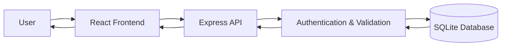
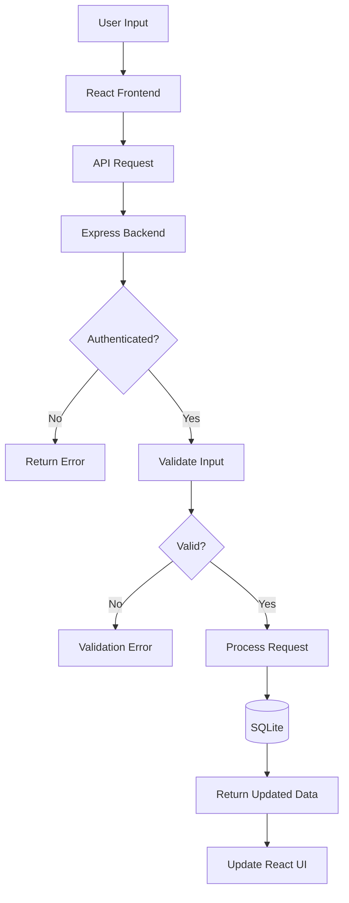
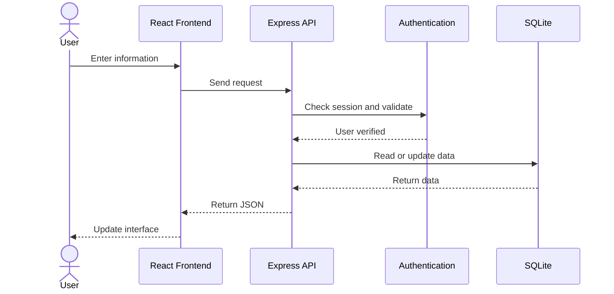
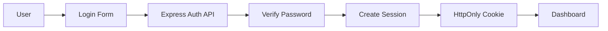
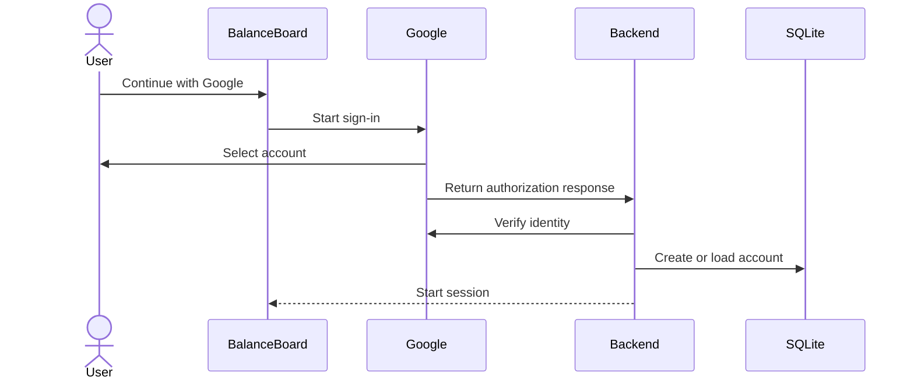
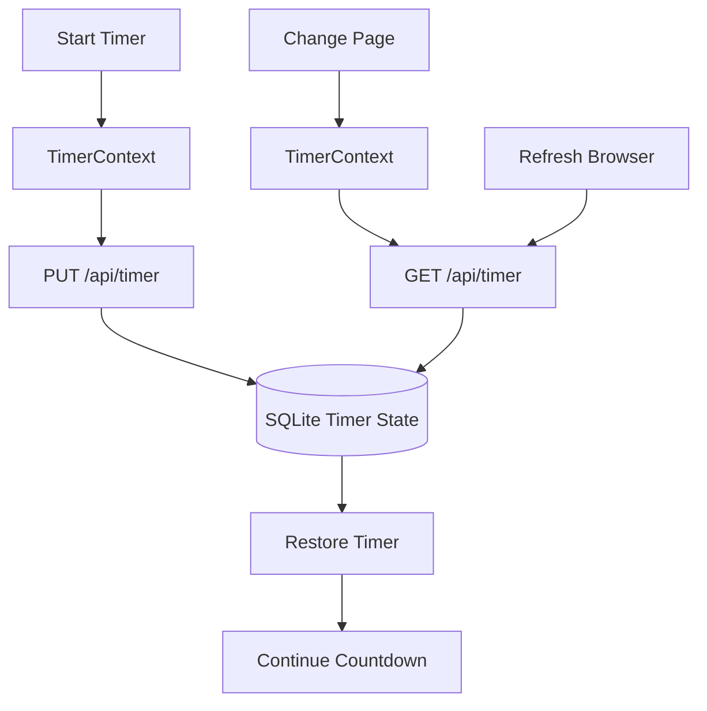
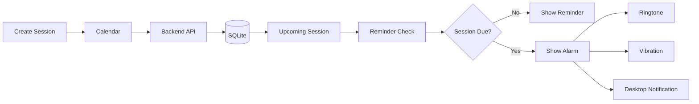
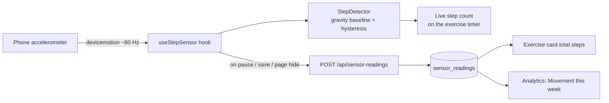
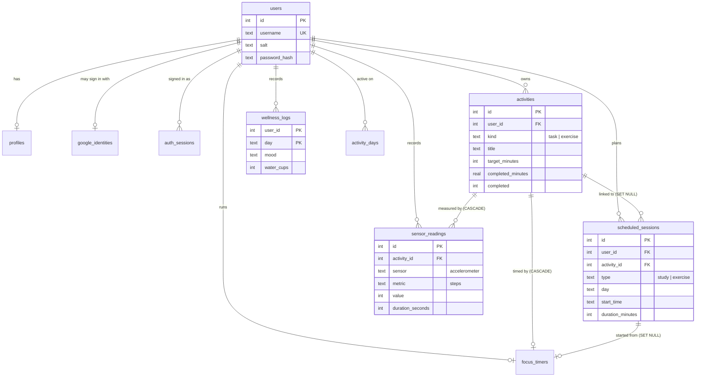

<div align="center">

```text
● ● ● ● ● ● ● ● ● ● ● ● ● ● ●
●                             ●
●       BALANCEBOARD          ●
●   Study • Focus • Wellbeing ●
●                             ●
● ● ● ● ● ● ● ● ● ● ● ● ● ● ●
```

# BalanceBoard

A full-stack productivity and wellbeing web app for managing study tasks, exercise, calendar sessions, focus time, mood, hydration and progress.

</div>

---

## Overview

We built BalanceBoard to keep daily study and wellbeing activities in one place.

The app allows users to:

- create an account and sign in
- add, edit and delete study tasks and exercise activities
- count steps with the phone's accelerometer during exercise sessions
- schedule sessions in the calendar
- run a focus or exercise timer
- track mood and water intake
- view reminders, analytics and achievements
- update profile and alarm settings
- keep data saved between sessions

The application uses **React**, **Express**, and **SQLite**.

---

## Main Features

- User registration and login
- Google sign-in support
- Study task management
- Exercise tracking
- Accelerometer step counting (sensor integration)
- Persistent focus timer
- Calendar scheduling
- Mood tracking
- Hydration tracking
- Reminder system
- Ringtone and vibration support
- Desktop browser notifications
- Profile settings
- Analytics and achievements
- Per-user data separation
- SQLite persistence
- Frontend and backend validation

---

# System Architecture

BalanceBoard uses a three-layer architecture.



### Frontend

React handles the user interface:

- Dashboard
- Login and registration
- Study tasks
- Exercise
- Calendar
- Profile
- Timer
- Reminders
- Analytics
- Achievements

The frontend communicates with the backend through HTTP requests.

### Backend

Express handles:

- API requests
- authentication
- validation
- session management
- timer actions
- profile updates
- study and exercise actions
- calendar actions
- reading and writing database data

### Database

SQLite stores:

- users
- sessions
- profile settings
- study tasks
- exercise activities
- calendar sessions
- mood entries
- hydration entries
- timer state
- progress data

---

# Input → Processing → Output



### Input

Examples:

- username, email and password
- study task title
- focus minutes
- exercise activity
- date and time
- mood
- water intake
- timer controls
- profile settings

### Processing

1. The user enters information.
2. React sends the request to Express.
3. Express checks the session.
4. The backend validates the data.
5. The requested action is processed.
6. SQLite is updated.
7. The backend returns JSON.
8. React updates the page.

### Output

Examples:

- updated task list
- timer countdown
- saved progress
- calendar sessions
- reminders
- mood and hydration records
- analytics
- achievements
- profile information

---

# Application Data Flow



Example:

```text
User creates a study task
        ↓
React form
        ↓
POST /api/tasks
        ↓
Express backend
        ↓
Authentication + validation
        ↓
SQLite
        ↓
Updated data
        ↓
React dashboard
```

---

# Authentication Flow

## Password Login



Passwords are protected using **scrypt with a unique salt**.

After login, the server creates a session token. The browser stores the session using an **HttpOnly cookie**.

---

## Google Sign-In



Google login uses the authorization-code flow with state, nonce and PKCE.

---

# Timer Architecture

The timer is stored on the backend instead of only inside one page.

This allows it to continue when the user moves between Dashboard, Calendar, Profile and Analytics.



Timer actions include:

- start
- pause
- resume
- reset
- discard
- complete
- save progress

---

# Calendar and Alarm Flow



The browser can play a ringtone, use vibration when supported and show desktop notifications when permission is enabled.

---

# Sensor Integration: Accelerometer Step Counting

Exercise is one of the four parts of the Balance Score, but timed minutes alone do not show how active a session was.
While an **exercise** timer is running on a phone, BalanceBoard reads the accelerometer through the browser's
`DeviceMotionEvent` API and counts steps.



- **Algorithm** (`src/services/stepDetector.js`): the acceleration magnitude is compared with a moving baseline
  (gravity). A rise of more than 1.6 m/s² that falls back below 0.4 m/s² counts as one step, with at least
  300 ms between steps. Unit tests simulate walking, running, a still phone and hand tremor.
- **Permissions and fallbacks** (`src/hooks/useStepSensor.js`): iOS asks for motion permission from a button;
  desktops and unsupported browsers show a clear message and the timer still works. Readings need HTTPS.
- **Validation**: the API rejects step rates above 4 steps per second and readings for another user's exercise.

---

# Database Design

All tables are in SQLite with foreign keys enforced (`PRAGMA foreign_keys=ON`).
Every user-owned row carries `user_id`, and every query filters by it.



CHECK constraints keep data valid even if a bug slips past the API (for example `water_cups BETWEEN 0 AND 8`,
`mood IN ('great','good','okay','low','stressed','')`). Databases created by earlier versions, which stored
records as JSON in one `items` table, are migrated automatically on start-up (`server/src/db.js`).

---

# Technology Stack

| Area | Technology |
|---|---|
| Frontend | React |
| Build Tool | Vite |
| Backend | Node.js |
| API | Express |
| Database | SQLite (Node's built-in `node:sqlite`) |
| Authentication | Password login + Google OAuth |
| Password Security | scrypt |
| Sessions | HttpOnly cookie |
| Sensor | DeviceMotion API (accelerometer) |
| Source Control | Git + GitHub |

---

# Project Structure

```text
BalanceBoard/
│
├── public/
├── scripts/
│   └── dev.js
│
├── server/
│   ├── data/                  SQLite database (not committed)
│   └── src/
│       ├── server.js          entry point
│       ├── app.js             builds the Express app
│       ├── config.js          environment settings
│       ├── db.js              schema + legacy migration
│       ├── googleAuth.js      Google ID-token verification
│       ├── lib/               errors, validation, password hashing
│       ├── middleware/        auth, security headers, rate limit, errors
│       ├── models/            activities, sessions, activity days
│       ├── routes/            auth, profile, tasks/exercises, sessions,
│       │                      wellness, sensor-readings, timer, dashboard
│       └── *.test.js          API, migration, timer and account tests
│
├── src/
│   ├── components/            layout, tasks, exercise, wellness, analytics
│   ├── context/               Auth, Dashboard and Timer state
│   ├── hooks/useStepSensor.js accelerometer integration
│   ├── pages/                 Dashboard, Analytics, Calendar, Achievements, Profile, Login
│   ├── services/              API client, alarms, step detector (+ test)
│   └── styles/global.css
│
├── .env.example
├── .gitignore
├── DEPLOY.md
├── README.md
├── index.html
├── package.json
├── package-lock.json
└── vite.config.js
```

---

# How to Run BalanceBoard

## 1. Requirements

Install:

- Node.js 22.13 or newer
- npm

Check:

```bash
node -v
npm -v
```

---

## 2. Clone the Repository

```bash
git clone https://github.com/kushalshrestha303-web/BalanceBoard.git
cd BalanceBoard
```

---

## 3. Install Frontend Dependencies

```bash
npm ci
```

---

## 4. Install Backend Dependencies

```bash
npm ci --prefix server
```

---

## 5. Start the App

```bash
npm run dev
```

Open:

```text
http://localhost:5173
```

The development setup starts:

```text
Frontend: http://localhost:5173
Backend:  http://localhost:3001
```

You can create a normal account immediately.

Google sign-in is optional.

---

# Google Sign-In Setup

Create a Google OAuth Web Application in Google Cloud Console.

Use:

```text
Authorized JavaScript origin:
http://localhost:5173
```

```text
Authorized redirect URI:
http://localhost:5173/api/auth/google/callback
```

Copy:

```text
.env.example
```

to:

```text
.env
```

Add:

```env
GOOGLE_CLIENT_ID=your_google_client_id
GOOGLE_CLIENT_SECRET=your_google_client_secret
APP_ORIGIN=http://localhost:5173
```

Restart:

```bash
npm run dev
```

Do not commit `.env` to GitHub.

---

# Production Build

Build the app:

```bash
npm run build
```

Start the production server:

```bash
npm start
```

Open:

```text
http://localhost:3001
```

---

# Database

The local SQLite database is stored in:

```text
server/data/balanceboard.sqlite
```

The database stores the application data and keeps it available after restart.

Do not upload the SQLite database to GitHub.

Recommended `.gitignore` entries:

```gitignore
node_modules/
.env
.env.local
.env.production
dist/
.vercel/
server/data/*.sqlite
server/data/*.sqlite-*
```

---

# API Overview

All endpoints return JSON. Everything except `/api/health` and `/api/auth/*` (apart from `me` and `logout`)
needs the session cookie; requests for another user's records return **404**.

| Method | Path | Purpose | Success |
|---|---|---|---|
| POST | `/api/auth/register` | Create account and sign in | 201 |
| POST | `/api/auth/login` | Sign in | 200 |
| POST | `/api/auth/logout` | Sign out | 200 |
| GET | `/api/auth/me` | Current user | 200 |
| GET | `/api/auth/google`, `/api/auth/google/callback` | Google sign-in | 302 / 303 |
| GET / PATCH | `/api/profile` | Profile and alarm settings | 200 |
| PATCH | `/api/profile/password` | Change password (signs out other devices) | 200 |
| GET / POST | `/api/tasks` | List / create study tasks | 200 / 201 |
| GET / PATCH / DELETE | `/api/tasks/:id` | Read / edit / delete a task | 200 / 200 / 204 |
| POST | `/api/tasks/:id/progress` | Log focus minutes | 200 |
| GET / POST | `/api/exercises` | List / create exercises | 200 / 201 |
| GET / PATCH / DELETE | `/api/exercises/:id` | Read / edit / delete an exercise | 200 / 200 / 204 |
| POST | `/api/exercises/:id/progress` | Log exercise minutes | 200 |
| GET / POST | `/api/sessions` | List / schedule calendar sessions | 200 / 201 |
| GET / PATCH / DELETE | `/api/sessions/:id` | Read / edit / delete a session | 200 / 200 / 204 |
| GET / PATCH | `/api/wellness/:day` | Mood and water for a day | 200 |
| GET / POST | `/api/sensor-readings` | Accelerometer step readings | 200 / 201 |
| GET / PUT | `/api/timer` | Current timer / choose activity | 200 |
| POST | `/api/timer/actions` | start, pause, reset, save, discard | 200 |
| GET | `/api/dashboard?day=YYYY-MM-DD` | Everything the dashboard needs in one call | 200 |
| GET | `/api/alarms/due?day=…&time=HH:mm` | Calendar sessions due now | 200 |

Errors use `{ "error": "message" }` with 400 (invalid input), 401 (not signed in), 403 (cross-origin write),
404 (not found or not yours), 409 (conflict), 413 (body over 32 KB) or 429 (too many login attempts).

Example:

```http
POST /api/tasks
Content-Type: application/json

{ "title": "Finish React assignment", "category": "Assignment", "focusMinutes": 50 }
```

---

# Testing

Build check:

```bash
npm run build
```

Run tests:

```bash
npm test
```

`npm test` runs 16 automated tests (Node's built-in test runner):

| File | What it checks |
|---|---|
| `src/services/stepDetector.test.js` | Step counting accuracy (walking, running), no false steps when still, cadence limit |
| `server/src/api.test.js` | CRUD for tasks, exercises, sessions, wellness and sensor readings; ownership (IDOR) on every endpoint; input validation; mass assignment; 413/400 handling; CSRF origin check; SQL injection on login; rate limiting |
| `server/src/migration.test.js` | Upgrading an old JSON-based database without losing data |
| `server/src/server.test.js` | Registration, login, logout, profile, password change, account separation, alarms, Google sign-in flow |
| `server/src/timer.test.js` | Timer survives a server restart, pause/resume, stale tabs, no double-saving |

---

# Simple Architecture Explanation

BalanceBoard uses **React** for the frontend, **Express** for the backend and **SQLite** for the database.

When a user performs an action, React sends a REST request to Express. The backend checks the user's session, validates the information and then reads or updates SQLite. The result is returned to React and shown on the screen.

The timer is also stored in the backend so it can continue across different pages and recover after a refresh.

---

## Repository

https://github.com/kushalshrestha303-web/BalanceBoard

## Team

ICT930 Advanced Web Application Development, Assessment 3:

- Kushal Shrestha
- Susmita Pantha
- Dev Kaji Gurung

<div align="center">

**Plan • Focus • Track • Balance**

</div>
